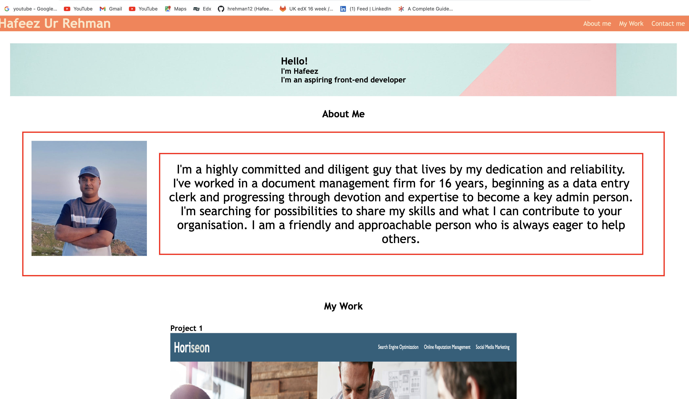

# week2-assignment

## Portfolio website 

### [Link to deployed Website](): 
### [Link to GitHub repo]():

## Acceptance Criteria

* When the page is loaded the page presents my name, a recent photo or avatar, and links to sections about you, your work, and how to contact you
* When one of the links in the navigation is clicked then the UI scrolls to the corresponding section
* When viewing the section about my work then the section contains titled images of that applications
* My First application then that application's image should be larger in size than the others
* When images of the applications are clicked then the user is taken to that deployed application
* When the page is resized or viewed on various screens and devices then the layout is responsive and adapts to my viewport

### Screenshot of website

